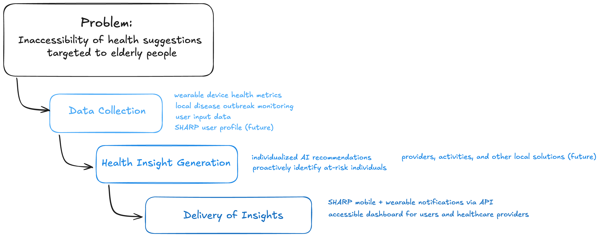

### 2024 BIG DATA HACKATHON PROPOSAL FORM

#### Team Number: `204`

#### Team Name: `Alpha Animals`

#### Your team's hackathon idea in one sentence:
Our team envisions a unified interface to streamline insights from wearable health device data, increasing health recommendation accessibility for the growing proportion of elderly patients in the San Diego community.

#### A visual

#### Hackathon Five CORE Themes.
- [ ] Access to care
> How can we make it easier to access care (especially specialists) and provide clear, timely notifications, and reminders along their healthcare journey?
- [ ] Patient satisfaction
> How can we make it more convenient for patients to provide real-time feedback about their healthcare experience through a mobile app?
- [ ] New patient experience
> As a potential new customer, how can we leverage the mobile app to help new patients better understand what services are available to them?
- [X] Managing my health
> It's easy to get overwhelmed by all the tasks patients often have to do to maintain their health, how can we make managing health more enjoyable?
- [ ] Addressing mental health challenges
> Mental health challenges may be difficult to identify and have a broad impact on health, how can we help clinicians be more in tune with patients mental health needs?

#### Optional Questions.
- [ ] Cultural Competence in Healthcare
> How can we design a mobile app that helps healthcare providers better understand and respect cultural differences, improving communication and care for diverse patient populations?
- [ ] Access to Care for Rural and Remote Communities
> How can we leverage technology to improve healthcare access for rural and remote communities, ensuring timely and specialized care for those in underserved areas? (Focus on SDSU Imperial Valley Connection - Rural/Remote)
- [X] Enhancing disease prevention (For Geocomputational Thinker Awards)
> How can big (geospatial) data analytics and AI be used to improve access to information about the influence of human behavior, cultural practices, and social interactions on the spread of diseases?
- [ ] Addressing environmental health disparities (For Geocomputational Thinker Awards)
> How can we leverage big (geospatial) data analytics and AI to improve access to resources that mitigate the impact of environmental factors, i.e. pollution, on health disparities?

#### Team Coordinator GitHub Username: Carter Tran - `CarterT27`

#### Team Members
- Carter Tran `CarterT27`
- Suchit Bhayani `suchitbhayani`
- Ryan Cao `RyanCao2005`
- Anirudh Annabathula `ani9280`
